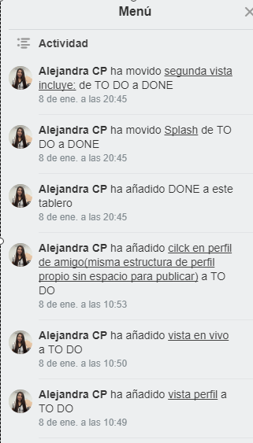
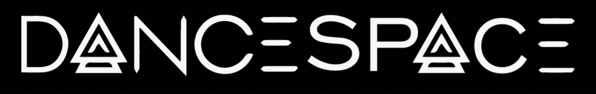
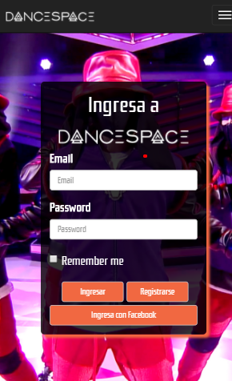

# Dancespace
Dancespace es una red social donde encontrarás apasionados por el baile como tú, tus crews favoritas y puestos de trabajo para bailarines.

## Desarrollado para
[Laboratoria](http://laboratoria.la)

### Introducción
>DANCESPACE es una nueva red social, que nace con la idea de reunir, conectar, compartir y generar información sobre puestos laborales entre personas apasionadas por el baile.

>Nuestro target son personas de 17 años en adelante, que tengan acceso a internet y que quieran conocer gente con sus mismos gustos y pasiones.

>Más allá de ello, DANCESPACE busca servir de plataforma en donde toda persona, con una cuenta registrada pueda acceder a la información de un vacante de puesto, relacionada al ámbito, así como también generar una.

### Herramientas
>* jQuery.
>* Bootstrap.
>* Firebase.

### Proceso de desarrollo
>* Planificación: En esta etapa implementamos una lista de tareas en trello para agendar nuestro tiempo.

> * Brainstorming: En esta etapa desarrollamos diversas ideas para elegir el producto final tales como tema, nombre y creación del logo.

> * Research: En esta etapa se realizó entrevistas vía redes sociales y directamente a personas apasionadas por la danza y que la practican.

>* Scketh: En esta etapa vimos diversos tipos de diseños, planteamos nuestras vistas y elegimos el diseño final.

>* Desarrollo: En esta etapa "codeamos".

## CEO
>[Alejandra Cabrera](https://github.com/AlejandraCP)

>[Anais Olivares](https://github.com/AnaisOlivares)
